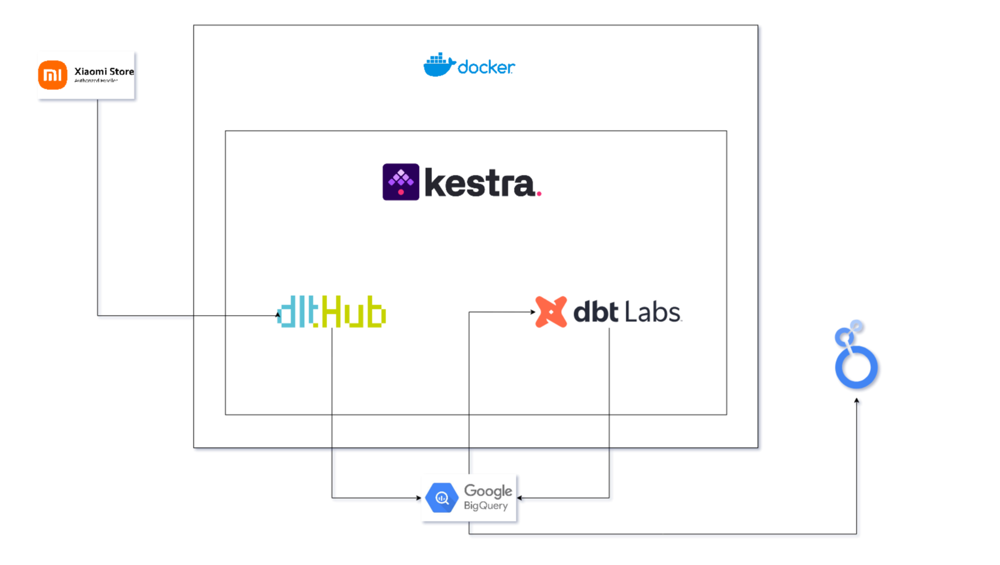

# Ecommerce Inventory Pipeline: Analyzing Product Availability and Trends

## Table of Contents
1. [Problem Statement](#problem-statement)
2. [Project Solution](#project-solution)
    - [Key Steps](#key-steps)
3. [Tech Stack](#tech-stack)
4. [Prerequisites](#prerequisites)
5. [How to Run This Project](#how-to-run-this-project)
6. [Datasets](#datasets)
    - [Main Dataset](#main-dataset)
7. [Main Process](#main-process)
    1. [Data Extraction & Cleaning](#data-extraction--cleaning)
    2. [Data Transformation & Analysis](#data-transformation--analysis)
    3. [Visualization & Insights](#visualization--insights)
8. [Conclusion & Acknowledgment](#conclusion--acknowledgment)

---

## Problem Statement

Ecommerce platforms can often benefit from competitor analysis. So understanding product trends, stock status, and sales performance of competitor sites can give the required edge to step up againt the odds. This project aims to build an end-to-end data pipeline to analyze product availability and trends for an ecommerce store, focusing on the following key questions:

- How many products are currently in stock?
- What are the trends in product additions over time?
- What is the distribution of the products in the categories?

---

## Project Solution

This project implements a data pipeline to extract, load, transform, and visualize product data from an ecommerce store. The pipeline integrates data ingestion, transformation, and visualization to provide actionable insights into product availability and trends.

### Key Steps:
1. **Data Extraction**: Extract product data from the ecommerce store's REST API using dlt.
2. **Data Loading**: Store the transformed data in BigQuery for querying and visualization.
3. **Data Transformation**: Use dbt to clean, standardize, and model the data for analysis.
4. **Visualization**: Create dashboards to analyze product trends and stock status.

---

## Pipeline Architecture

Below is the architecture of the pipeline used in this project:



This diagram illustrates the flow of data from extraction to visualization, highlighting the tools and processes involved at each stage.

## Tech Stack

- **BigQuery**: Data Warehouse for storing and querying structured data.
- **Sqlite**: Lightweight database for local testing and debugging.
- **dlt**: Data Loading Tool for extracting and loading data.
- **dbt**: Data Transformation Tool for modeling and cleaning data.
- **Kestra**: Workflow orchestration for automating the pipeline.
- **Looker Studio**: Data visualization for creating interactive dashboards.
- **Docker**: Containerization for running the pipeline in isolated environments.

---

## Prerequisites

To successfully run this project, ensure you have the following tools and services set up:

- Google Cloud Platform (GCP) account with access to BigQuery and GCS
- Docker installed on your local machine
- Proper authentication and access permissions to GCP services
- Bash shell terminal (needed to use the quickstart.sh to spin up kestra, can be used without it as well)

---

## How to Run This Project

To run this project, follow these steps:

1. **Set Up the Environment**:
    - Create a `.env` file in the root directory of the project.
    - Add the required fields from a service account with access to BigQuery. The `.env` file should include credentials and configuration details for GCP services.

2. **Start the Orchestrator**:
    - If you have a Bash terminal available, execute the `quickstart.sh` script:
      ```bash
      ./quickstart.sh
      ```
      This script will automate the setup and start the orchestrator (Kestra).

    - If a Bash terminal is not available, manually perform the steps in the `quickstart.sh` script:
      - Build and run the Docker container to start the kestra orchestrator with setting up the individual environment variables from the .env file.

    - Run the flow named ecommerce_inventory_flow from the UI or through the API.

3. **Run the Pipeline**:
    - Use the Kestra API or web interface to trigger the pipeline workflows.
    - Monitor the pipeline execution and ensure all tasks complete successfully.

4. **Verify the Results**:
    - Check the BigQuery tables for the transformed data.
    - Open [Looker Studio](https://lookerstudio.google.com/s/u6gGdCfOaag) to view the dashboards and analyze the insights.

## Datasets

### Main Dataset:
- **Source**: Product data from the ecommerce store's REST API (`https://mistore.pk/products.json`).
- **Schema**:
  - Product attributes (e.g., `id`, `title`, `product_type`)
  - Variant attributes (e.g., `variant_id`, `available`, `price`)

---

## Main Process

### 1. Data Extraction & Cleaning

The first step involves extracting product data from the ecommerce store's REST API using the `dlt` library. The pipeline handles pagination and processes the data to remove unwanted attributes and add custom fields.

- **Tools**: `dlt`, Python
- **Key Steps**:
  - Extract product data from the API.
  - Remove unnecessary attributes (e.g., `images`, `tags`).
  - Add custom attributes (e.g., `store_id`).

### 2. Data Transformation & Analysis
The extracted data is transformed using dbt to create clean and structured models for analysis. The transformation process includes:

- **Staging Models**:
    - `stg_products`: Cleans and standardizes product data.
    - `stg_products__variants`: Cleans and standardizes variant data.

- **Core Models**:
    - `fact_products`: Combines product and variant data to create a fact table.
    - `inventory_report`: Aggregates product availability and trends. This model is partitioned by the `publising_month` field for efficient querying of per month product additions and clustered by `stack_status` to improve the stock chart query.

- **Tools**: dbt, SQL

### 3. Visualization & Insights

- **Final Report**: [Looker Studio Dashboard](https://lookerstudio.google.com/s/u6gGdCfOaag) showcasing the visualizations and insights.

- **Dashboards Information**:
  - **Product Availability**: Displays in-stock and out-of-stock products.
  - **Category Trends**: Highlights popular product categories of the ecommerce store.
  - **Inventory Trends**: Analyzes product addition trends by month.

---

## Conclusion & Acknowledgment

This project demonstrates the power of modern data engineering tools in building scalable and efficient data pipelines. By integrating `dlt`, dbt, BigQuery, and Looker Studio, we were able to extract, transform, and analyze product data to gain valuable insights into inventory trends.

### Acknowledgment
I would like to thank the Data Engineering Zoomcamp and its instructors for providing the knowledge and resources to complete this project. Special thanks to the open-source community for their contributions to the tools used in this pipeline.

---
